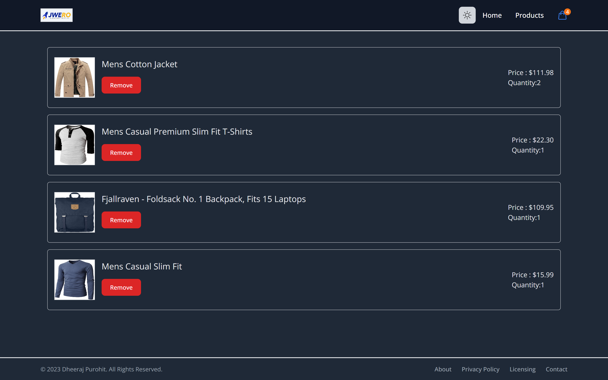

# Welcome to JWero Store!

JWero Store is an innovative and captivating e-commerce platform built with cutting-edge technologies, designed to provide users with a seamless shopping experience. This repository houses the codebase for JWero Store, where we leverage the power of React, React Router, and Tailwind CSS to create a visually stunning and highly functional online store.

## Tech Stack

- **React:** The heart of JWero Store is built using React, allowing for dynamic and interactive user interfaces that respond in real-time to user actions.

- **React Router:** Seamlessly navigate between different sections of the store using React Router. Our well-organized routing structure ensures a smooth and intuitive browsing experience.

- **Tailwind CSS:** JWero Store boasts a modern and appealing design thanks to Tailwind CSS. Its utility-first classes empower us to style our components with precision and speed.

## Features

### Responsive Routes

JWero Store offers multiple routes for an engaging user journey:

- **Home:** The landing page that welcomes users with featured products and enticing visuals, setting the tone for an exciting shopping experience.

- **Cart:** A dedicated cart page where users can review their selected items, make modifications, and proceed to checkout.

- **Product Listing:** This section showcases the entire range of products available, complete with clear images, concise descriptions, and prices.

### Add to Cart

Selecting desired items from the product listing has never been easier. Just a click on the "Add to Cart" button, and your chosen products will be neatly stored in your virtual shopping cart.

### Remove from Cart

Changed your mind about a product? No problem. JWero Store allows you to effortlessly remove items from your cart with a simple click.

### Quantity Count

Customize your shopping experience by adjusting the quantity of items directly from the cart page. Our intuitive interface makes it a breeze to increase or decrease item quantities to match your preferences.

### Dark Mode

JWero Store cares about your browsing preferences. With our built-in Dark Mode feature, you can enjoy a comfortable shopping experience even in low-light conditions. Simply toggle Dark Mode on or off to suit your visual comfort.

## Installation

To run JWero Store locally, follow these steps:

1. Clone this repository: `git clone https://github.com/purohitdheeraj/Product-Listing.git`
2. Navigate to the project directory: `cd jwero-store`
3. Install dependencies: `npm install`
4. Start the development server: `npm start`
5. Open your browser and visit: `http://localhost:3000`

## Get Started

Embark on your shopping journey by exploring JWero Store today. With its striking design, user-friendly features, efficient tech stack, and Dark Mode, you're bound to have an unforgettable shopping experience.

Feel free to contribute, report issues, or reach out with suggestions. Happy shopping!

## Screenshots

_Welcome to JWero Store!_

_Your Shopping Cart - Review and Proceed to Checkout_

_Browse Our Wide Range of Products_

---

_JWero Store - Bringing Joy to Online Shopping_
